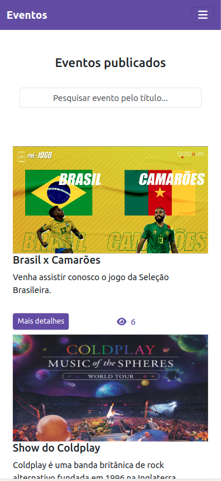

# Boas-vindas ao repositório do projeto Eventos!

Este projeto é uma aplicação de publicação de eventos desenvolvida utilizando React, Firebase e Bootstrap.

## Sumário
  - [Boas vindas ao projeto Eventos](#boas-vindas-ao-repositório-do-projeto-eventos)
  - [Sumário](#sumário)
  - [Sobre a aplicação](#sobre-a-aplicação)
  - [Instalando e rodando a aplicação](#instalando-e-rodando-a-aplicação)
  - [Preview](#preview)
  
## Sobre a aplicação
Esta aplicação foi desenvolvida com finalidade de estudos e possui as seguintes funcionalidades:

  - Autenticação de Usuários
  - Recuperação de senha com envio de e-mail automático
  - Cadastro de Usuários
  - Publicar, editar, remover e pesquisar eventos para usuários logados.
  - Pesquisa de eventos para usuários visitantes
  - Quantidade de Visualizações de um evento
  - Upload de imagem
  - Layout responsivo
  
## Instalando e rodando a aplicação
Para rodar a aplicação localmente é necessário ter o Node instalado na máquina.

Posteriormente, clone o repositório e execute os seguintes comandos na raiz do projeto:
  ```js
    npm install
    npm start
  ```
  
## Preview

<table>
  <tr>
    <th colspan="2" style="text-align: center">Login</th>
  </tr>
  <tr>
    <td style="text-align: center">Desktop</td>
    <td style="text-align: center">Mobile</td>
  </tr>
  <tr>
    <td>
      
    </td>
    <td>
      
    </td>
  </tr>
</table>

<table>
  <tr>
    <th colspan="2" style="text-align: center">Register</th>
  </tr>
  <tr>
    <td style="text-align: center">Desktop</td>
    <td style="text-align: center">Mobile</td>
  </tr>
  <tr>
    <td>
      
    </td>
    <td>
      
    </td>
  </tr>
</table>

<table>
  <tr>
    <th colspan="2" style="text-align: center">Forgot Password</th>
  </tr>
  <tr>
    <td style="text-align: center">Desktop</td>
    <td style="text-align: center">Mobile</td>
  </tr>
  <tr>
    <td>
      
    </td>
    <td>
      
    </td>
  </tr>
</table>

<table>
  <tr>
    <th colspan="2" style="text-align: center">Home</th>
  </tr>
  <tr>
    <td style="text-align: center">Desktop</td>
    <td style="text-align: center">Mobile</td>
  </tr>
  <tr>
    <td>
      
    </td>
    <td>
      
    </td>
  </tr>
</table>

<table>
  <tr>
    <th colspan="2" style="text-align: center">Event Details</th>
  </tr>
  <tr>
    <td style="text-align: center">Desktop</td>
    <td style="text-align: center">Mobile</td>
  </tr>
  <tr>
    <td>
      
    </td>
    <td>
      
    </td>
  </tr>
</table>

<table>
  <tr>
    <th colspan="2" style="text-align: center">Create Event</th>
  </tr>
  <tr>
    <td style="text-align: center">Desktop</td>
    <td style="text-align: center">Mobile</td>
  </tr>
  <tr>
    <td>
      
    </td>
    <td>
      
    </td>
  </tr>
</table>
